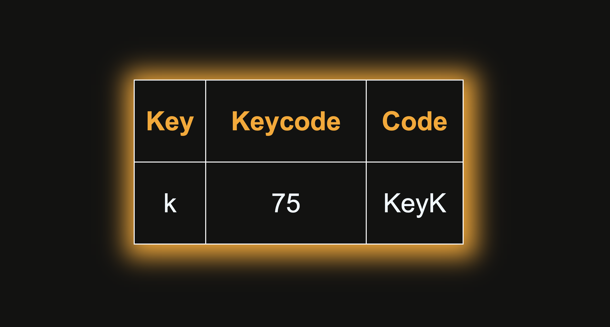

## Keyboard Checker

**Keyboard Checker** is a simple and interactive web app that detects and displays real-time keyboard input.  
Whenever you press a key, it instantly shows its **`key`**, **`keyCode`**, and **`code`** values — helping you understand how keyboard events work in JavaScript.

---

## Description

This project visually demonstrates **JavaScript keyboard events**.  
It’s perfect for **beginners** who want to understand how `keydown`, `keypress`, and `keyup` work in real-time.  
The app is fully front-end (HTML, CSS, JS) and runs directly in your browser.

---

### 💻 App Interface
> Press any key on your keyboard to see details appear instantly on screen.

## Screenshots

